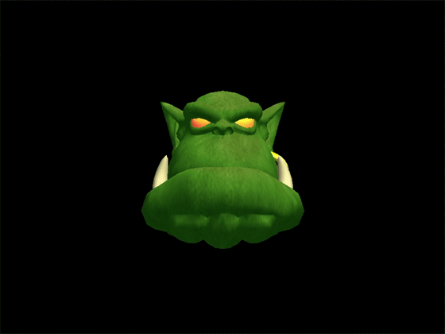
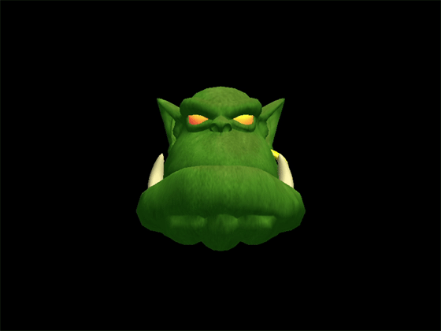

# OGRE Demo

This is a project based on OGRE engine. It used the tutorial of OGRE and "ogrehead.mesh" 3D model to build the demo. You can use keyboard to control the 3D model move, rotate and zoom.

## USAGE
---
### Move
To move the model, I use `wasd` to  control the model. The key `w` can control the model move up. The `s` can make it move down. And the keys `a` and `d` can control it move left and right. Each press of the key will make the model move 1 unit.

### Rotation
To rotate the model, I use 6 keys `xiyjzk` for 3 dimensions. The keys `x` and `i` can control the model rotate around the X-axis from 2 direction. The keys `y` and `j` can control the model rotate around the Y-axis from 2 direction. The keys `z` and `k` can control the model rotate around the Z-axis from 2 direction. Each press of the key will make the model rotate 0.1 radian.

### zoom
Zoom is more simple than rotation. It only use 2 keys, `l` and `m`. Press the `l`, you can make the model 1.05X large. And press the `m`, the model will be 0.95X smaller.

> ADDITION: You can use the ESC key to exit the program.

## IMPLEMENTION DETAIL & THOUGHTS
---

To capture the key inputs, I use the `inputlistener` to get the keyboard input. And to change the entity, I get the child scene node from the scene manager. Then use the `translate()` function to contral the move, `pitch()`, `yaw()` , `roll()` funcitons to control the rotation around the three axis and `scale()` funciton to control the zoom.

With this project, I know how to manage a entity in OGRE and how to build a keyboard action with `inputlistener`. And from my demo, I saw the different light angle leads to different apperance of the model.