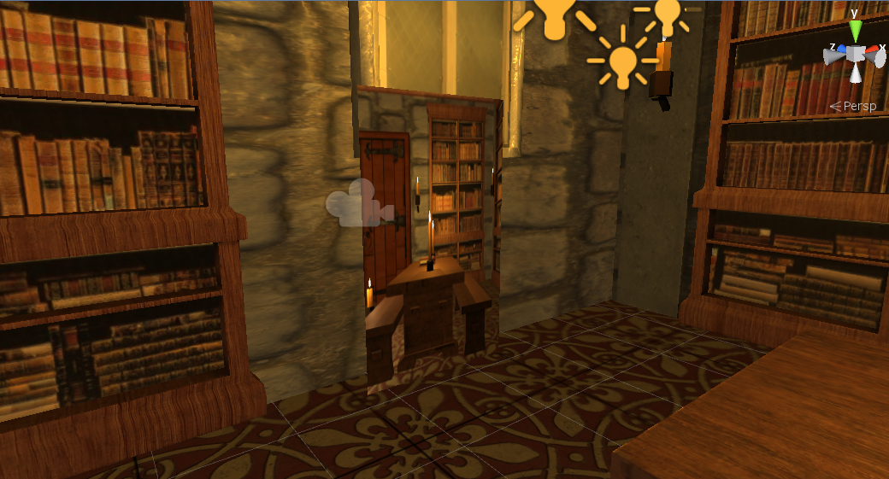
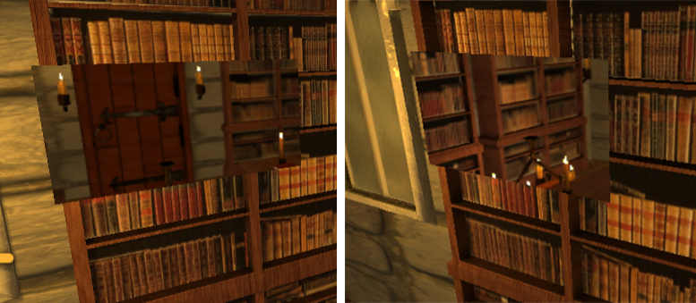
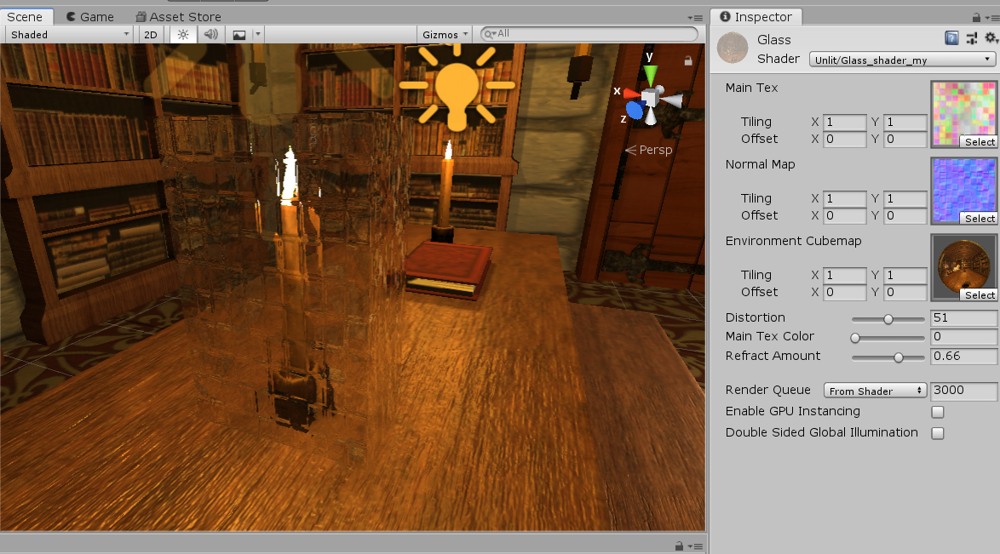
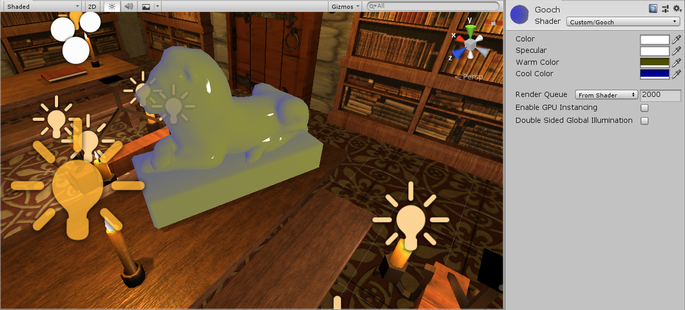

# Unity Shader
This is a project of the unity shader practice. It include 3 basic shader: mirror shader, glass shader and Gooch Shading shader. These shader are showed in the Room sence. In a shader, it include 2 basic functions: `vert` and `frag`. `vert` is the vertex shader funciton, `frag` is the fragment shader funciton. In the `vert` function, we usually transform coordinate of the vertices and do prepare for the fragment shader. In `frag` function, we calculate the color for each pixel.

## 1. Mirror Shader
---
I use a camera to get a mirror. I created a plane and a camera. By adjust the position , angle and view of the camera, it can get a picture that the mirror should show. I used a texture as the target texture of the camera, and map the texture to the plane by the mirror shader, and the mirror shader just flip the **x** coordinate of the texture to generate the mirror pixture.

But this mirror just like a picture. if you move your view point, the content in the mirror will not change. Because the camera is a fixed camera, it will not move following the view point. So I used a C# script to update the camera position and replace the texture, build a camera that can move with follow the view point and render the objects by the reflection camera.(This part refers to the Unity sample [MirrorReflection4](http://wiki.unity3d.com/index.php/MirrorReflection4) on unity3d wiki.)

## 2. Glass Shader
---
A glass shader include 2 parts: refraction and reflection. 

For refraction, I use `Distortion` and `Normal map` to control it. It produce the refraction by calculating the coordinate offset of the screen behind the glass(`_RefractionTex`), which is generated by the GrabPass. It conbine the `Normal map` of the texture and `Distortion` to decide the offset direction and offset size.

For reflection, I used the `Normal map` to decide the reflection function, and calculate the reflection direction according to the view point. And finally combine the reflection color and the glass main texture accornding to the `Main Tex Color` property.

Then finally I linear interpolation combine the refraction and reflection with the interpolation parameter `Refract Amount`.

In Unity3D, you can see the glass box cover a candle. you can adjust Distortion, Main Tex color and Refract Amount to change the rendering of the shader. And the nomal map should the normal texture of the main texture if the Main Tex Color is not zero. The Envirorment Cubemap shoud a cubemap for the box, it should be a camera capture the 6 pixture for each direction from the position of the box.

## 3. Gooch Shading Shader
---
Gooch shading model use warm color and cool color to control the shading. The surface is warm or cool decided by the angel of the light, view point, and the normal of the surface. After we get the coordinate of the view point and the light, we can calculate the shading by the following formular:

$$\mathbf{c}_{\text {shaded }}=s \mathbf{c}_{\text {highlight }}+(1-s)\left(t \mathbf{c}_{\text {warm }}+(1-t) \mathbf{c}_{\text {cool }}\right)$$

and

$$\begin{aligned}
\mathbf{c}_{\mathrm{cool}} &=(0,0,0.55)+0.25 \mathbf{c}_{\mathrm{surface}} \\
\mathbf{c}_{\mathrm{warm}} &=(0.3,0.3,0)+0.25 \mathbf{c}_{\mathrm{surface}} \\
\mathbf{c}_{\mathrm{highlight}} &=(1,1,1) \\
t &=\frac{(\mathbf{n} \cdot \mathbf{l})+1}{2} \\
\mathbf{r} &=2(\mathbf{n} \cdot \mathbf{l}) \mathbf{n}-1 \\
s &=(100(\mathbf{r} \cdot \mathbf{v})-97)^{\mp}
\end{aligned}$$

where $n$ is the normal of the surface, $l$ is the light direction, and $v$ is the view direction. $(0, 0, 0.55)$ and $(0.3, 0.3, 0)$ is the cool color and the warm color. $c_{surface}$ is the texture surface color. In my shader, you can adjust the cool color, warm color, Specular color($c_{highlight}$) and surface color ($c_{surface}$).

