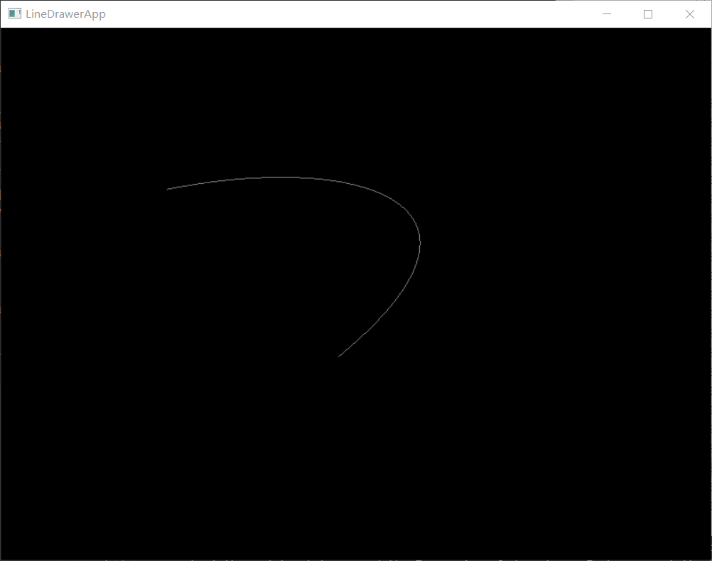
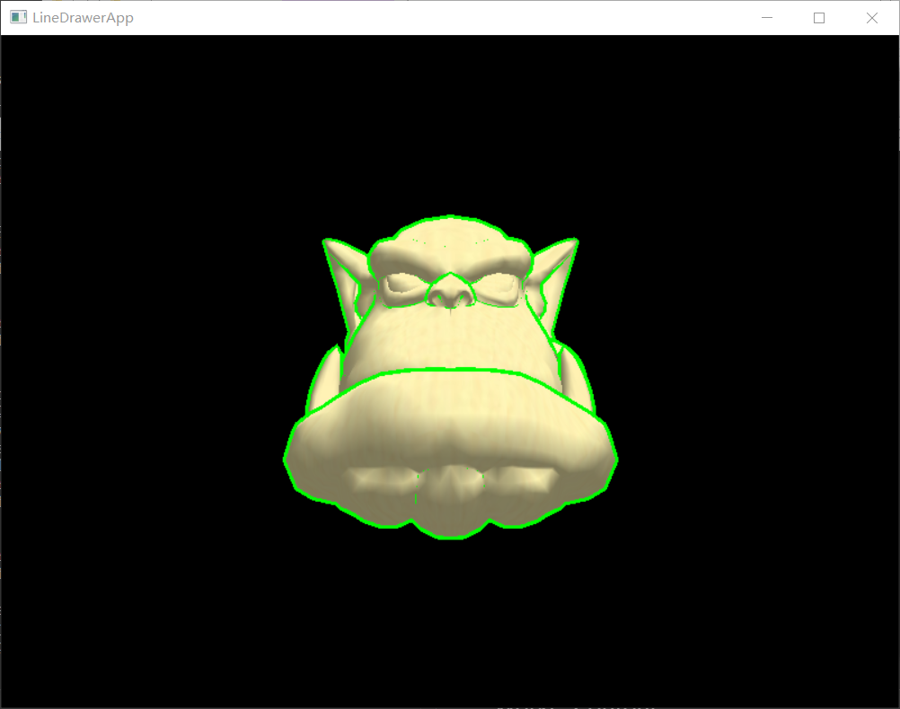

# Homework 3

This is a project based on OGRE engine. It used the tutorial of OGRE and "ogrehead.mesh" 3D model to build the demo. You can use keyboard to control the 3D model move, rotate and zoom as it in homework1.

## Work1: Bézier curve
---
#### Implementation
To build a Bézier curve from 4 point, I use the `mousePressed` function to get the position of the 4 point that mouse clicked. And if the user have click the mouse 4 time, the program will start draw the line and stop to record the position where mouse clicked. To draw the curve, I use 1000 lines to simulate the curve according to the function of Bézier curve. 

#### Usage
The program and the dll files are in `Work1` directory. You can run `Work1/bin/work1.exe` to use the program.

## Work2: Contour
---
#### Implementation
I use material to implement the contour. I created 2 files `Edge.material` and `edge.hlsl` to draw the contour. `Edge.material` define a ogre material `Ogre/edge` with 2 passes and link it to the `edge.hlsl`. In the first pass, I extend the vertices along the normal of surface. that make it the position of the vertices is at the outside ot the model. And than set it to green(or other color) to indecate the ourline. Then in the second pass, we render the model as normal. Finally we can get a model with green(or other color) ourline.

