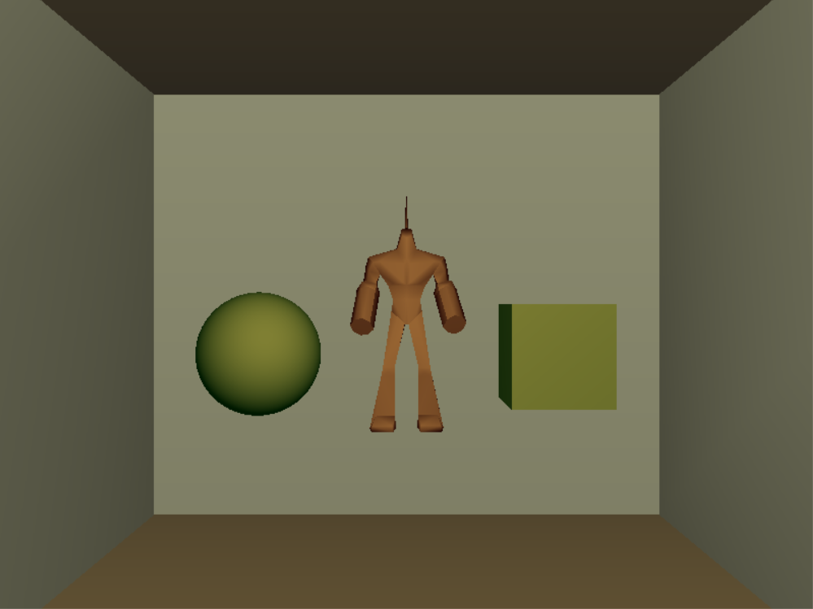
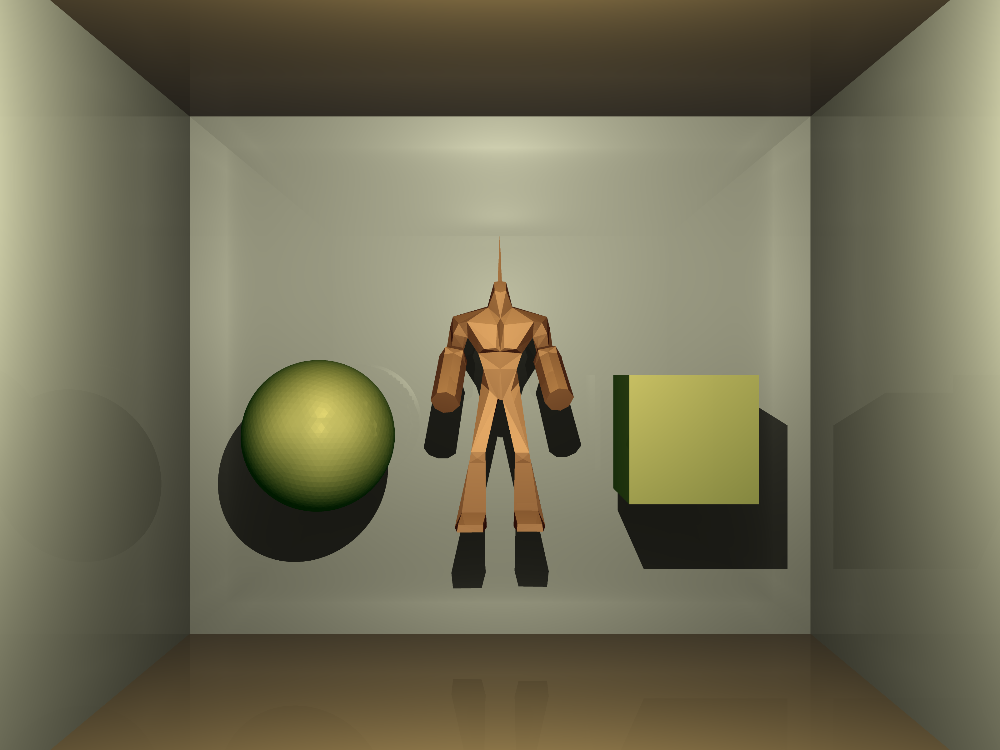

# Ray Tracing

这是一个基于OGRE实现的Ray Tracing项目。主要实现了基于blinn-phong光照模型下的简单的光线追踪算法。并加入了多线程优化和2x2抗锯齿。可以在2秒内完成一张追踪深度为3的800x600分辨率图片的渲染。

## 实现细节
代码基于OGRE场景，设置了灯光集合`lightList`和物体集合`entityList`， 之后基于灯光和物体信息对每个像素进行Ray Tracing 渲染, 并实现了一系列相关函数。

* `build_ray()` 函数中，通过构建Texture的方式来保存光追结果。使用多线程调用`traceRow()`对每一行像素进行渲染，将渲染结果存入Texture的缓存中，并将Texture保存为图片。
* `traceRow()`对一行中的每一个像素通过调用`Tracer()`进行渲染，并且在开启抗锯齿时每个像素渲染四条光线取平均以提高渲染效果。
* `Tracer()`中实现了对于光线的递归追踪算法。`Tracer()`通过先找到相交物体，再计算物体的直接光照，最后叠加物体的间接光照的方式来实现光线追踪算法。在整个追踪算法中光线按照传播距离平方的速度进行衰减，为了实现较好的衰减效果，设置了常数unit作为单位长度。
* 在`Tracer()`中调用的`calcColor()`实现了根据物体的属性，通过blinn-phong光照模型来计算表面颜色和反射光颜色的算法。
* 在计算直接光照的过程中调用的`getLightInfo()`， 它不只从光源获取到光线信息，还判断了物体间的遮挡关系，去掉了被其他物体挡住的光线。
* 整个Tracing过程中最重要的就是判断物体与射线相交的函数`InterectionTest()`, 它通过判断包围盒和物体的三角面片的方式来判断物体是否与光线相交，并且得到最近的相交点和交点平面。
* **多线程优化与抗锯齿**。本次的代码加入了多线程技术以提高渲染速度，对设置了10个线程的线程池，并对每一行像素放入不同线程单独处理，最终达到了数倍的性能提升。基于如此的性能提升，程序可以在5分钟内在开启2x2抗锯齿，追踪深度为5的情况下渲染完成一张3200*2400图片的渲染。

## 效果展示
我们搭建了一个room box来展示我们的效果。这个box包含4个较为光滑的面作为四周的墙，而屋顶和地面采用了反射率相对较低的材质。并且box中防止了球体，正方体和一个机器人作为示例。

下面的第一张图片OGRE默认的渲染效果, 使用默认分辨率(800x600)，可以看到几乎没有反射的效果，光线的阴影也不清晰。效果比较差。

而下面第二张图片是我们经过5次光线追踪之后获得的图片，开启了抗锯齿效果，并且使用16倍分辨率(3200x2400)渲染，在光照效果和细节上明显比上面的图片好了很多。物体的明暗及光影都有了充分的体现。

